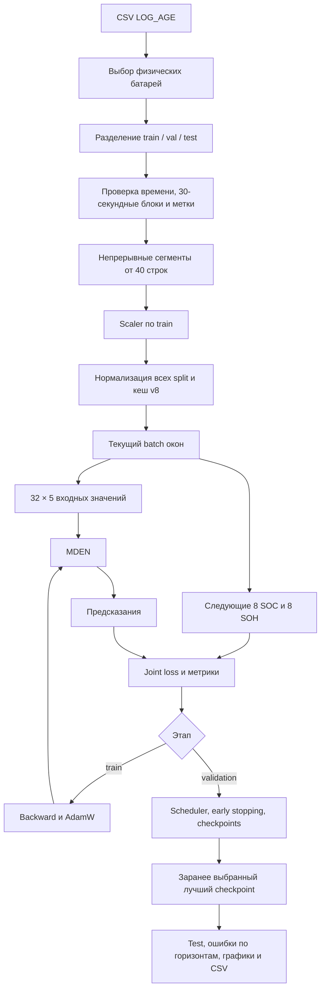
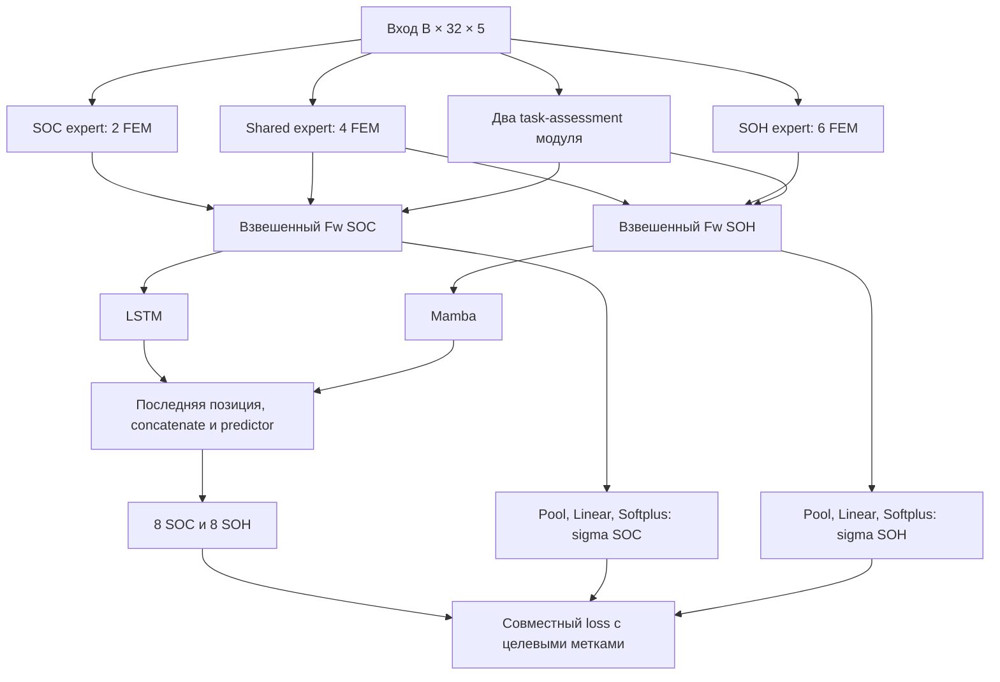

> Историческое описание предыдущей редакции. В 0.5.0 добавлены физический loss и очистка кеша; monitor по умолчанию — balanced_rmse. Актуальные дополнения и ограничения: [PHYSICS_AND_MODEL_REVIEW_RU.md](PHYSICS_AND_MODEL_REVIEW_RU.md), результаты проверки — VALIDATION.json.

**Как работает `04_train_v2_fixed.ipynb`**

Ноутбук содержит 46 ячеек, из них 35 с кодом. Функции вынесены в модули, а ячейки последовательно настраивают, запускают и проверяют отдельные этапы. Все размеры ниже относятся к конфигурации `32 → 8`, stride 8, пять входных признаков.

**1. Настройка и первичные проверки**

Определяется корень проекта, проверяется, что Python импортировал `mden_battery` именно из него. Читается YAML. Проверяются неизвестные поля и контракт архитектуры: пять признаков, горизонт восемь, глубины 2/4/6, четыре ConvRound внутри каждой FEM. Отдельные ячейки задают пути, число батарей, batch, precision, LR, weight decay, monitor и возможность resume.

**2. Отбор и разделение данных — `data/log_age.py`**

`discover_sources` разбирает имя CSV. Батарея — `P+replicate`; канал измерения сохраняется в manifest. Если для батареи доступны 2s и 30s версии, выбирается 30s. Неоднозначные дубликаты вызывают ошибку. Для кандидатов читаются допустимые sparse-измерения ёмкости; выбирается нужное число батарей с минимум двумя anchors. Seed фиксирует выбор.

`split_cells` случайно распределяет физические батареи по train/val/test. При долях 20% val и 20% test используются округления вверх для val/test, остальные батареи — train. У одной батареи все её окна принадлежат одному split.

**3. Временные блоки, очистка и метки**

Из CSV читаются `timestamp_s, EFC, v_raw_V, i_raw_A, t_cell_degC, soc_est, cap_aged_est_Ah`. Проверяются конечность обязательных значений и последовательность времени. Нули тока допустимы и не удаляются как выбросы.

Для 2s данных `resample_query` группирует по физическим 30-секундным интервалам: требуется 15 корректных строк с шагом 2 секунды в пределах допуска 0.25 s. EFC, напряжение, ток, температура и SOC усредняются. Неполные/повреждённые интервалы помечаются непригодными. В готовом 30s источнике сохраняется уже рассчитанная интервальная оценка. Временная отметка обозначает правый край завершившегося блока.

`soc = soc_est / 100`. Небольшой допуск исходной оценки вокруг границ −1…101% обрезается до 0…1; значения за допуском исключаются. `soh = capacity / 3 Ah`; ёмкость интерполируется линейно по времени между anchors. Экстраполяции за крайние измерения нет. Эта интерполяция является оффлайн-разметкой, а не частью прогноза модели.

`prepared_values` разбивает оставшиеся строки на непрерывные сегменты. Пропущенная строка, временной разрыв или неправильный bin создают границу. Сегменты короче 40 строк исключаются, потому что из них не получится ни одного полного обучающего окна.

**4. Масштабирование и кеш**

Среднее и стандартное отклонение вычисляются только по пяти признакам train. Расчёты выполняются в float64; стандартное отклонение постоянного признака заменяется единицей. Затем все split преобразуются одним train-scaler: `(x − mean) / std`. SOC и SOH не стандартизуются.

Один NPY на батарею содержит семь float32-столбцов: `cycle, time_s, voltage_V, current_A, temperature_C, soc, soh`. В KIT первые два означают EFC и время эксперимента. Индекс хранит split, число строк, offsets сегментов и число окон. Перед публикацией новой генерации проверяются формы, типы, конечность, диапазоны меток, границы сегментов и scaler. Повторный запуск с совпадающими настройками использует кеш v8.

**5. Формирование окон — `data/window_batches.py`**

Для сегмента из L строк число окон равно `max(0, 1 + floor((L − 40) / 8))`. Для начала окна `s` используются:

| Тензор | Срез массива батареи | Форма |
|---|---|---|
| `x` | `[s:s+32, :5]` | B × 32 × 5 |
| `y_soc` | `[s+32:s+40, 5]` | B × 8 |
| `y_soh` | `[s+32:s+40, 6]` | B × 8 |

Окна не переходят через границы сегментов. Train перемешивает номера отдельных окон; val/test идут в фиксированном порядке. Хранятся исходные строки (CPU mmap или GPU cache) и компактная таблица сегментов. При итерации собирается только текущий плотный batch; копии всех окон одновременно не создаются. Последний неполный batch сохраняется.

**6. Устройство и короткие проверки**

На CPU AMP отключён. На CUDA до Ampere выбирается FP16, при поддержке нативного BF16 — BF16. FFT, критические нормализации, состояние SSM и loss рассчитываются с повышенной точностью. При автоматическом batch выполняются короткие train-step измерения скорости и памяти. При resume используется прежний размер batch.

Перед обучением отдельные ячейки проверяют формы выходов, конечность, сумму fusion-весов, независимость прогноза от соседних объектов batch и backward обеих sigma-голов. Эти проверки не обновляют параметры реальной модели. Optimizer, scheduler, GradScaler и состояние запуска создаются в отдельных ячейках.

**7. Архитектура — `feature_extraction.py`, `model.py`, `mamba.py`**

Внутри каждой FEM FFT выполняется вдоль 32 временных позиций отдельно для объекта. Амплитуды усредняются по пяти каналам. Из положительных частот выбираются top-k; одинаковые амплитуды имеют стабильный порядок. Частоты преобразуются в периоды `p=ceil(32/f)`. Для каждого периода вход дополняется нулями и преобразуется в `B × C × ceil(T/p) × p`.

Далее выполняются четыре ConvRound: расширение каналов свёрткой 1×1, grouped 3×3 и сжатие 1×1. Результат возвращается к временному ряду, дополненные значения удаляются. Ветви объединяются с softmax-весами FFT-амплитуд. Это явно выбранная трактовка неполностью раскрытой агрегации статьи. Эксперты возвращают форму B × 32 × 5.

Task assessment получает исходный вход и выдаёт по два веса для каждой задачи. Shared и соответствующий task-specific результат складываются с этими весами. SOC-Fw проходит через LSTM, SOH-Fw — через Mamba. Рекуррентные состояния создаются заново в каждом окне.

В Mamba две нормализованные ветви проходят линейные проекции. Основная ветвь: causal depthwise Conv1d → SiLU → selective SSM. Она перемножается с SiLU gate-ветвью, проходит выходную линейную проекцию и RMSNorm. Выбран layout по рисунку 4 статьи. Serial и parallel scan вычисляют одну и ту же рекуррентность; optional CUDA kernel использует те же параметры.

Последние временные позиции LSTM/Mamba объединяются по каналам. Predictor `1×1 Conv → ReLU → 1×1 Conv` выдаёт 16 каналов, разделяемых на восемь SOC и восемь SOH. Такая временная редукция указана как допущение: статья не описывает её однозначно.

**8. Loss и обновление параметров — `loss.py`, `runtime.py`**

Обе sigma-головы получают Fw до рекуррентных модулей. Они используют усреднение по времени, Linear и Softplus; sigma ограничена снизу `1e-4`. MSE каждой задачи делится на `2*sigma²`, добавляются два `log1p(sigma)`, затем берётся среднее по объектам.

Train выполняет forward → FP32 loss → scaled backward → корректировку среднего при накоплении → unscale → clipping → AdamW → обновление GradScaler. Optimizer включает параметры модели и sigma-голов; для A_log и D Mamba отключён weight decay. Validation использует eval/inference mode и не обновляет веса.

**9. Выбор checkpoint — `checkpoints.py`**

После validation scheduler получает выбранный `MONITOR`. Обновляются независимые лучшие joint/SOC/SOH/balanced показатели, сохраняется `last.pt` и улучшившиеся лучшие checkpoints. Early stopping считает эпохи без улучшения того же monitor. Это позволяет позже анализировать различие критериев, сохраняя все лучшие по validation модели.

**10. Test и постобработка — `visualization.py`**

Загружается checkpoint по критерию, заданному до обучения. Test проходит один раз для этого выбора. Вычисляются глобальные RMSE/MAE, ошибки каждого из восьми горизонтов, R² и WMAPE. Для постоянной цели R² записывается как null. Метрики усредняются по реальному числу объектов; каждый test-объект учитывается один раз.

Предсказания не сглаживаются и не обрезаются до физических границ перед расчётом метрик. Для подписей графиков доли умножаются на 100; это проценты состояния, а ошибка — процентные пункты. Обратного преобразования target-scaler нет, потому что цели не стандартизовались.

На каждом из трёх графиков показываются две разные батареи, выбранные фиксированным seed без учёта ошибки. Исторические SOC/SOH показаны только для контекста. Справа от границы входа сравниваются восемь целевых и предсказанных значений: +30 s … +4 min. Вместе с PNG сохраняются исходные числа прогноза в CSV и история обучения. Никакой дополнительной физической коррекции после MDEN эта версия не применяет.
